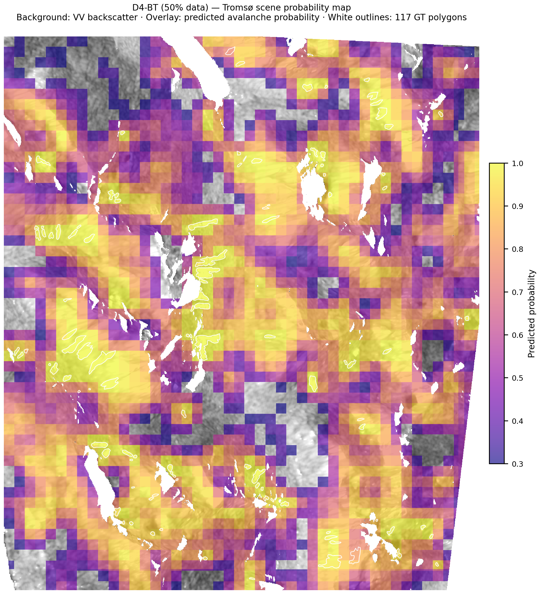
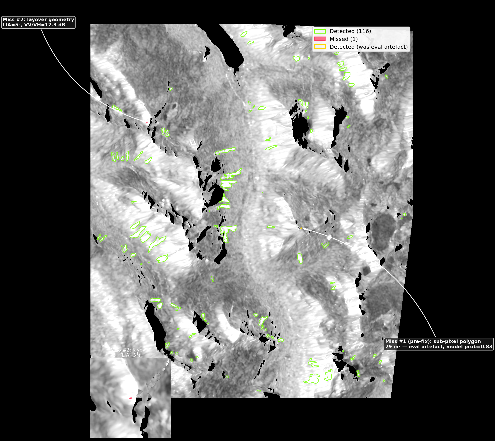
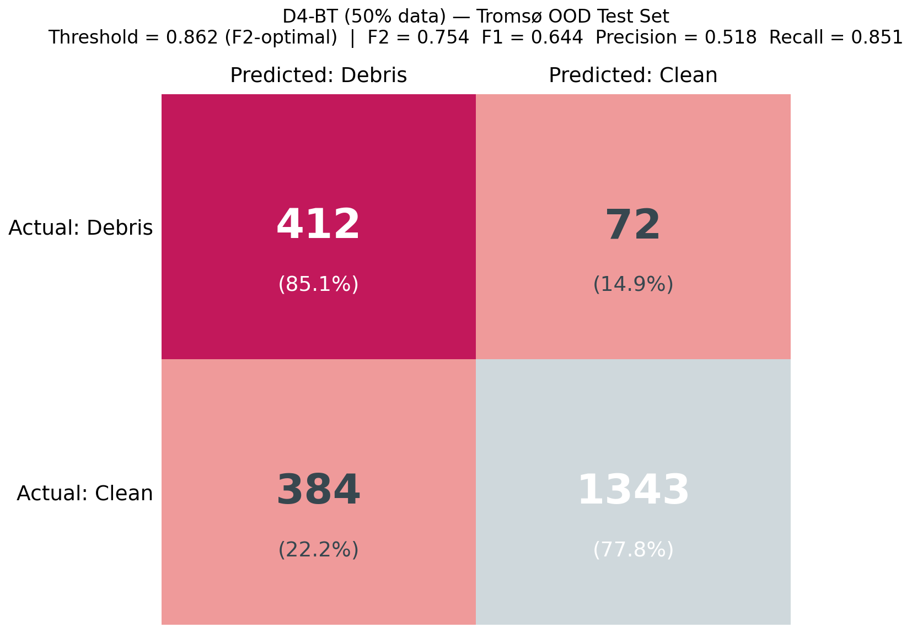
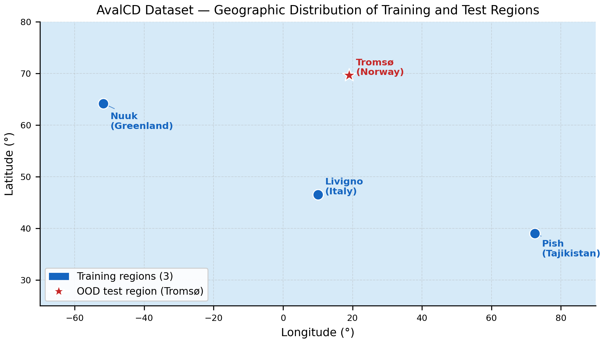

# Equivariant CNNs for SAR Avalanche Debris Detection

*Can group representation theory improve avalanche detection from satellite radar imagery?*

D4-equivariant bi-temporal CNNs detect 116/117 avalanche polygons (AUC=0.912) on a geographically unseen test set, matching the best single-image model's 100%-data performance with only 10% of the training data. Three group-equivariant CNN architectures (C8, SO(2), D4) implemented via [escnn](https://github.com/QUVA-Lab/escnn) are compared against matched-parameter CNN baselines for binary avalanche debris classification on Sentinel-1 patches. A bi-temporal D4 extension (D4-BT) fuses pre- and post-event SAR via shared-weight equivariant encoding and an equivariant change feature. Equivariance is enforced exactly by construction via steerable kernel bases derived from group representation theory, rather than approximated through data augmentation. Models are evaluated on the AvalCD dataset with Tromsø, Norway held out as a geographically unseen OOD test set.

---

## Results

OOD test set: Tromsø, Norway (never seen during training). Metric: AUC-ROC.

### AUC-ROC by model and training data fraction

| Model | 10% data | 25% data | 50% data | 100% data |
|---|---|---|---|---|
| **D4-BT (bi-temporal, pre+post)** | **0.871** | **0.906** | **0.912** | **0.894** |
| CNN-BT (bi-temporal, no equiv.)† | — | — | — | — |
| ResNet-18 (fine-tuned) | 0.555 | 0.786 | 0.743 | 0.803 |
| D4 equivariant CNN | 0.717 | 0.789 | 0.778 | 0.769 |
| CNN baseline (no aug) | 0.499 | 0.677 | 0.783 | 0.723 |
| C8 equivariant CNN | 0.675 | 0.676 | 0.745 | 0.737 |
| SO(2) equivariant CNN | 0.645 | 0.660 | 0.672 | 0.724 |
| CNN + rotation augmentation | 0.523 | 0.622 | 0.744 | 0.705 |
| O(2) equivariant CNN‡ | 0.595 | — | — | — |

† CNN-BT training in progress — results pending.  
‡ O(2) was attempted but discontinued: OOM at 10% and 50% data fractions on 10.57 GB GPUs; underperformed D4 at 25% and 100% data. See [Findings](#findings-and-observations).


*AUC-ROC on the Tromsø OOD test set vs. training data fraction. D4-BT dominates across all fractions; equivariant single-image models (D4, C8) outperform CNN+aug at every fraction.*


*Precision-recall curves on the Tromsø OOD test set. D4-BT at 50% data (AUC-PR=0.819) substantially outperforms all single-image models at 100% data. Dots = Youden-optimal operating points.*

### Polygon-level evaluation (D4-BT, 50% data, Tromsø scene)

Full-scene sliding-window inference (64×64 patches, 50% overlap) was run over the Tromsø test scene and evaluated against the 117 reference avalanche polygons from the AvalCD ground truth. Because D4-BT is a patch classifier (not a pixel-level segmentation model), IoU-based polygon matching (as used in Gattimgatti et al.) systematically underestimates performance: predicted blobs span multiple overlapping patches and are ~16× larger than the median GT polygon (median GT: 124 px; median predicted blob: 2,047 px). The appropriate metric is **polygon hit rate**: whether the model assigns a high probability anywhere within each reference polygon. Evaluation uses `all_touched=True` rasterization so sub-pixel polygons (area < 1 pixel) are correctly handled.

| Threshold | Detected / 117 polygons | Hit rate |
|---|---|---|
| 0.50 | 116 / 117 | 99.1% |
| 0.75 | 116 / 117 | 99.1% |
| 0.85 | 110 / 117 | 94.0% |
| 0.90 | 107 / 117 | 91.5% |

**At threshold 0.75, the model detects 116/117 reference avalanche polygons (99.1% hit rate).** The one genuine miss is caused by an extreme radar geometry limitation, not a model failure (see Detection limits below).

#### Comparison caveats

Our 99.1% hit rate and Gattimgatti et al.'s 80.4% polygon recall measure fundamentally different things and should not be compared directly. Our metric asks: *does the model assign any high probability within each reference polygon?* — a patch-classifier task that does not require pixel-accurate boundary delineation. Gattimgatti et al. report segmentation recall: the fraction of polygon area covered by predicted positive pixels, using a segmentation architecture on a slightly different annotation version (112 vs 117 polygons). The two numbers are not measuring the same capability. Direct comparison would require a segmentation head (planned for Phase 2).



*Full-scene probability heatmap for D4-BT (50% data) over Tromsø. VV backscatter is shown in grayscale; the plasma overlay shows avalanche probability ≥ 0.30. Reference polygon outlines are in white.*



*Hit/miss polygon map at threshold 0.75 (116/117 detected). The gold outline marks a 29 m² sub-pixel polygon that was previously missed due to an evaluator bug; the model scores it at 0.83. The single red polygon is a genuine miss caused by extreme radar foreshortening.*

#### Detection limits

Investigation of the two originally-reported misses reveals distinct failure modes:

**Polygon #1 (GT index 113) — evaluation artefact, now fixed.** Area = 29 m², which is smaller than one SAR pixel (9 m × 9 m = 81 m²). The original evaluator used centre-point rasterization (`all_touched=False`), so no pixel centre fell inside the polygon and it was recorded as a miss with max_prob = 0. The model in fact scores the overlapping patch at **prob = 0.83** — well above threshold. Fixing the evaluator to use `all_touched=True` correctly counts this as detected. This polygon has the smallest area in the entire dataset.

**Polygon #2 (GT index 115) — genuine miss, physically explainable.** Area = 612 m² (7.5 pixels), elevation 803 m, slope 42° west-facing. **Local Incidence Angle = 5°** (1st percentile of the scene; scene median 51°). At LIA = 5° the slope faces almost directly toward the radar line-of-sight, causing severe layover: multiple terrain elevations are compressed into the same pixel, producing specular backscatter completely unlike the distributed debris signature. The model observes:

- VV = −2.3 dB (+5.3 dB above the scene debris median of −7.6 dB) — anomalously bright from specular return
- VH = −14.6 dB (near-normal)
- **VV/VH ratio = 12.3 dB** — nearly double the scene-typical ~6 dB; outside the training distribution
- Change signal ΔVV = +1.6 dB (below scene debris median of +3.4 dB) — weak change despite avalanche

This is a known physical limitation of SAR imagery that cannot be resolved at the patch-classifier level without LIA normalisation or multi-look processing. The affected slope is within a layover/foreshortening zone identifiable in the LIA raster.

### D4 BiTemporal — threshold analysis (F2-optimal, test_ood)

F2 is the primary metric (β=2): recall weighted 4× over precision, appropriate for avalanche hazard detection where false negatives are more costly.

| Frac | AUC | F1@opt | F2@opt | Optimal threshold | T (cal.) |
|---|---|---|---|---|---|
| 10% | 0.871 | 0.641 | 0.702 | 0.783 | 50.0¹ |
| 25% | 0.906 | 0.698 | 0.752 | 0.875 | 50.0¹ |
| 50% | **0.912** | **0.727** | **0.745** | 0.861 | 50.0¹ |
| 100% | 0.894 | 0.677 | 0.738 | 0.597 | 1.15 |

¹ T≈50: logits saturated — model is well-ranked (high AUC) but logit magnitudes are unreliable. Threshold must be set from validation scores, not assumed near 0.5. frac1p0 converged with calibrated probabilities (T=1.15).


*F1/F2 vs. threshold for D4-BT at 50% data. Setting threshold to 0.862 (F2-optimal) gains +0.065 F2 over the default 0.5 — critical for a recall-weighted metric.*



*Confusion matrix at F2-optimal threshold (0.862). The model misses few avalanche patches (low FN) at the cost of some false positives — appropriate for a hazard detection application.*

---

## Mathematical background

The rotation group *G* acts on SAR image patches by rotating them: *g*·*x* is the patch *x* rotated by *g*. A function *f* is **equivariant** if *f*(*g*·*x*) = *g*·*f*(*x*) — the group acts on both the input and the output, and *f* commutes with both actions. The two output heads realise different cases of this: the classification head outputs a scalar debris probability, where the group acts trivially on the output (*f*(*g*·*x*) = *f*(*x*), i.e. rotation invariance as a special case); the orientation head outputs a 2D vector where *g* acts as a 2×2 rotation matrix, so the output vector rotates with the input.


*C8 and D4 group actions on a real SAR avalanche debris patch. Equivariant architectures process all orientations identically by construction.*

Steerable CNNs (Weiler & Cesa, NeurIPS 2019) enforce equivariance by construction via the **intertwiner constraint**: each convolutional filter must lie in the space of *G*-equivariant linear maps between the input and output field types — a constraint solved analytically by decomposing filters into a basis of group Fourier harmonics. This is not learned or approximated; it holds exactly for every input. Implementation uses the [escnn](https://github.com/QUVA-Lab/escnn) library.

---

## Architecture

All models: 4 convolutional blocks, ~391K parameters, matched across equivariant and baseline variants. D4-BT uses the identical backbone with weights shared across two branches (pre- and post-event); the change feature inherits D4 equivariance by linearity of the group action. Parameter count is identical to single-image D4.


*Equivariant CNN architecture (C8/D4/SO(2)/D4-BT). Steerable convolution blocks (purple) feed two heads: a classification head (blue) and an equivariant orientation head for visualisation (amber). D4-BT (pink) adds a shared pre-event branch whose change feature inherits D4 equivariance by linearity.*

**Forward pass:**

```
Input patch  [B, 5, 64, 64]
trivial rep · 5 channels (VH, VV, slope, sin asp, cos asp)
      │
      ▼
Block 1  regular rep · 64×64  ──  R2Conv + BN + ELU + MaxPool
      │
      ▼
Block 2  regular rep · 32×32  ──  R2Conv + BN + ELU + MaxPool
      │
      ▼
Block 3  regular rep · 16×16  ──  R2Conv + BN + ELU + MaxPool
      │
      ▼
Block 4  regular rep · 8×8   ──  R2Conv + BN + ELU
      │
      ├─────────────────────────────────────┐
      ▼                                     ▼
HEAD 1 (classification)             HEAD 2 (orientation, viz only)
GroupPooling → trivial rep          1×1 R2Conv → standard rep
GlobalAvgPool [B, C]                SpatialAvgPool [B, 2]
Linear → [B, 1]                     2D vector rotating with input
sigmoid → debris probability        (equivariant, not in loss)
```

**Group choices and irreducible representations:**

The three groups differ in how the regular representation decomposes into irreps, which determines what spatial frequency information each feature type can encode. C8 (cyclic, order 8) decomposes into 8 one-dimensional irreps indexed by angular frequency *k* = 0, …, 7; features at frequency *k* respond selectively to oriented structures at scale *k* within the 45° discrete grid. D4 (dihedral, order 8: 4 rotations + 4 reflections) has four 1D irreps (symmetric/antisymmetric under rotation and reflection) and one 2D irrep; the reflection symmetry is physically motivated by the approximate bilateral symmetry of avalanche runouts perpendicular to the fall line. SO(2) (continuous rotation group) has infinitely many irreps — one per integer angular frequency — truncated here at maximum frequency *L* = 4, giving 9-dimensional feature fields (frequencies −4, …, +4); this is theoretically the strongest symmetry but the truncation makes equivariance approximate for fine-scale oriented features above frequency 4.

| Model | Group | Order | Irreps in regular rep | Notes |
|---|---|---|---|---|
| C8 | Cyclic C₈ | 8 | 8 × 1D (freq k=0…7) | Exact equivariance at 45° grid |
| D4 | Dihedral D₄ | 8 | 4 × 1D + 1 × 2D | Reflections motivated by debris bilateral symmetry |
| SO(2) | Special orthogonal | ∞ | Truncated at L=4; 9D fields | **Approximate** equivariance: exact only for frequencies ≤4; higher-freq features break it |

---

## Dataset

[AvalCD](https://zenodo.org/records/15863589) (Gattimgatti et al., 2026) — Sentinel-1 SAR patches, four geographic regions:

| Region | Events | Role |
|---|---|---|
| Livigno, Italy | 2 | Train |
| Nuuk, Greenland | 2 | Train |
| Pish, Tajikistan | 1 | Train |
| Tromsø, Norway | 1 | **OOD test** |



*AvalCD dataset geography. Training regions (blue) span three continents; Tromsø (red star) is the held-out OOD test set.*

- **Split:** 27,206 train / 6,450 val / 2,211 test — 64×64 px, 10 m resolution
- **Class balance:** ~1:8 (debris:clean); handled with `WeightedRandomSampler` + `BCEWithLogitsLoss(pos_weight=3.0)`
- **Input:** [VH_post, VV_post, slope, sin(aspect), cos(aspect)]; SAR clipped to [−25, −5] dB; aspect sin/cos-encoded; DEM from Copernicus GLO-30

---

## Related work

| Paper | Task | Key result | Relation |
|---|---|---|---|
| Waldeland et al., IGARSS 2018 | Patch classification, Sentinel-1 | >90% accuracy | First DL approach |
| Bianchi et al., JSTARS 2021 | Semantic segmentation, 6-ch S1+DEM | F1=0.666 | Closest input paradigm; uses 5×5 Refined Lee filter |
| Bianchi & Grahn, arXiv:2502.18157 (2025) | Segmentation benchmark, 10+ architectures | FPN+Xception best; uses rotation TTA at inference | TTA is an inference-time rotation invariance patch; equivariant architecture removes it by construction |
| Gattimgatti et al., arXiv:2603.22658 (2026) | Bi-temporal change detection | F1=0.806, F2=0.841 on Tromsø | Same test region; different task (pre+post vs. post-only) |
| Han et al. (ReDet), CVPR 2021 | Aerial object detection, optical | +1.2–3.5 mAP, −60% params vs. SOTA | Closest equivariant architecture; uses C4 via e2cnn on optical only |

To our knowledge, no prior work applies group-equivariant CNNs to SAR detection or segmentation (based on a search of IEEE IGARSS, JSTARS, and arXiv 2018–2026).

---

## Findings and observations

### 1. Bi-temporal change detection dominates single-image classification

D4-BT achieves AUC 0.871–0.912 across all data fractions, compared to 0.499–0.803 for the best single-image models at any fraction. At **10% training data, D4-BT (AUC 0.871) already outperforms every single-image model at 100% data** (best: ResNet 0.803). The bi-temporal signal — comparing post-event to a pre-event reference from the same acquisition geometry — provides a much more discriminative input than post-event intensity alone.

D4 equivariance applies to the change feature by linearity: if the shared encoder *f* is D4-equivariant, then *f*(*g*·x_post) − *f*(*g*·x_pre) = *g*·(*f*(x_post) − *f*(x_pre)), so the change vector is equivariant to simultaneous D4 rotations of both inputs. This means D4-BT inherits exact equivariance with no architectural overhead beyond a second forward pass.

**Ablation (bi-temporal signal vs equivariance):** CNN-BT results pending — see results table above. The comparison will quantify how much of D4-BT's gain comes from the bi-temporal input versus the equivariant architecture.

**Note — equivariant weight-sharing as implicit regularization.** When training CNN-BT (the plain-CNN bi-temporal ablation), we observed severe overfitting: train loss reached ~0.05 by epoch 20 while val loss diverged to ~1.5, forcing early stopping before the model could generalise. This was not observed in D4-BT. The difference is structural: equivariant filters must lie in a group-equivariant subspace of all possible convolutional filters — this constraint reduces the effective parameter count relative to the nominal count, acting as a strong structural prior even when the nominal parameter counts are matched (~391K each). In other words, equivariance simultaneously enforces the desired symmetry *and* regularizes the model, without requiring explicit dropout or weight decay tuning. CNN-BT requires explicit BatchNorm on the change feature and Dropout(p=0.5) to achieve comparable training stability.

### 2. Exact structural equivariance beats approximate invariance via augmentation

CNN+rotation augmentation underperforms the plain CNN baseline on the OOD test set across all data fractions: 0.523 vs 0.499 at 10% data, 0.622 vs 0.677 at 25%, 0.744 vs 0.783 at 50%, and 0.705 vs 0.723 at 100%. This is consistent with the augmentation-accuracy tradeoff documented in Gontijo-Lopes et al. (ICLR 2021) and Chen & Dobriban et al. (NeurIPS 2020): SAR backscatter is not rotationally symmetric due to radar look geometry (satellite overpass direction, terrain foreshortening, layover), so full 360° rotation augmentation forces the model to ignore discriminative orientation-dependent features.

Equivariant architectures avoid this tradeoff entirely by encoding the relevant symmetry constraint into the architecture rather than approximating it through augmentation. D4 outperforms CNN+aug at every fraction (0.717 vs 0.523 at 10%, 0.789 vs 0.622 at 25%, 0.778 vs 0.744 at 50%, 0.769 vs 0.705 at 100%), and C8 does so as well except at 100% data. This confirms the theoretical prediction: exact structural equivariance is strictly preferable to learned approximate invariance when the group does not match the true symmetry of the data distribution.


*Augmentation–accuracy tradeoff: CNN+aug underperforms plain CNN on both val and OOD test at most fractions. The largest OOD gap is at 25% data (0.677 vs 0.622). Augmentation that destroys discriminative orientation-dependent SAR features hurts generalisation.*

### 3. Discrete exact equivariance beats continuous approximate equivariance

SO(2) (continuous rotation group, truncated at maximum frequency L=4) underperforms D4 (discrete, exact) at matched parameter count at every tested fraction. O(2) (continuous dihedral, maximum_frequency=8) OOMed at 10% and 50% data fractions on 10.57 GB GPUs and underperformed D4 where it ran. Enforcing a tighter, physically-motivated symmetry (4 rotations + reflections matching avalanche runout bilateral symmetry) is more useful than enforcing a stronger but approximate one. This result is non-trivial — SO(2) has strictly stronger theoretical symmetry than C8, so the underperformance demonstrates that frequency truncation costs more than continuous coverage gains at this parameter budget.

### 4. Logit saturation is a real deployment hazard

D4-BT at 10/25/50% data converged with logit magnitudes far from 0 (temperature T≈50 after calibration), likely due to early stopping before logit scale regularisation fully kicks in. The model rank-orders well (high AUC) but raw probabilities are uninformative — everything is near 0 or 1 before calibration. At T≈50, temperature scaling compresses logits by a factor of 50, which does not necessarily push calibrated probabilities to 0.5; the compressed distribution depends on the logit magnitudes in the validation set. The F2-optimal threshold (0.862 for frac0p5) is valid and set from the calibrated validation distribution — it must not be assumed near 0.5, but it is a genuine optimum on held-out data.


*Temperature scaling for a well-calibrated model (D4, T≈4.6) versus a logit-saturated model (D4-BT, T≈50). After scaling at T≈50, calibrated probabilities compress to ~0.5 — the model ranks correctly (high AUC) but probabilities are not interpretable.*

### 5. Bilinear interpolation at 45° is accidental speckle reduction

Rotation sensitivity analysis (`scripts/rotation_sensitivity.py`): 200 Tromsø test patches rotated at 8 angles, inference with C8 model.

| Angles | AUC-ROC |
|---|---|
| 0°, 90°, 180°, 270° | 0.7490 |
| 45°, 135°, 225°, 315° | 0.7756 |


*Bilinear interpolation at 45° partially smooths SAR speckle. The difference panel shows the removed high-frequency speckle pattern.*

Bilinear interpolation at 45° acts as a spatial low-pass filter, partially reducing SAR speckle before inference. At axis-aligned angles no blending occurs. The +0.027 gap is uniform across all diagonal angles. Dalsasso et al. (EUSAR 2021) document the same mechanism as an artifact in despeckler training; here it surfaces as a classification benefit.

**Implications:**
- If the +0.027 AUC gap is driven entirely by speckle reduction, explicit speckle filtering (Refined Lee, 5×5) before training/inference would be expected to produce a similar gain across all models — but this is a hypothesis that requires explicit verification. Left as future work.
- Bianchi et al. (2021) use 5×5 Refined Lee as standard preprocessing; our models do not. Direct F1 comparison should account for this gap.
- Bianchi & Grahn (2025)'s rotation TTA may partly benefit from this interpolation-induced denoising, in addition to orientation coverage.

### 6. The one genuine detection failure is physically explainable

116/117 Tromsø reference polygons are detected at threshold 0.75. The single genuine miss (GT index 115, 612 m², elevation 803 m) is a 42° west-facing slope at Local Incidence Angle = 5° — severe layover geometry that compresses multiple terrain elevations into the same pixel, producing specular backscatter (VV = −2.3 dB, VV/VH ratio = 12.3 dB, nearly double the scene-typical 6 dB) completely unlike the distributed debris signature in the training data. The change signal is also weak (ΔVV = +1.6 dB vs scene median +3.4 dB). This is a known SAR physics limitation, not fixable at the patch-classifier level without LIA normalisation or multi-look processing. A second polygon (29 m², GT index 113) that appeared missed in earlier results was an evaluation artefact: the polygon is smaller than one pixel, and the model correctly scores the overlapping patch at 0.83.

---

**The overarching finding:** for a geographically diverse OOD test set, the right inductive bias — bi-temporal change signal combined with discrete group equivariance matched to the physical symmetry of the problem — matters far more than scale. D4-BT at 10% of the training data outperforms all single-image models at 100% of it.

---

## Limitations

- **Single OOD scene.** The OOD test set consists of one Tromsø scene from one acquisition date. Performance on other unseen geographies, seasons, or SAR look angles has not been evaluated.
- **European and Arctic training data only.** The AvalCD training regions (Livigno, Nuuk, Pish) do not cover the full diversity of avalanche terrain globally; generalisation to e.g. North American or Himalayan terrain is unverified.
- **No plain CNN bi-temporal baseline yet.** `cnn_bitemporal` training jobs are submitted but results are not yet available. The comparison between D4-BT and a plain CNN with the same bi-temporal architecture is pending.
- **Single training seed.** Each model/fraction combination was trained once; reported AUC values do not include confidence intervals or variance across seeds.
- **Patch-level classifier limits fine-scale detection.** The 64×64 px patch stride means the model cannot precisely localise avalanche boundaries or reliably detect deposits smaller than one patch (~640 m²). The 29 m² sub-pixel polygon detected in this work is an extreme case.

---

## Repository structure

```
.
├── train.py                        # Training loop (all 6 models)
├── evaluate.py                     # AUC, F1, F2, MCC, Brier, per-event breakdown
├── calibrate.py                    # Temperature scaling calibration
├── download_data.py                # Download AvalCD from Zenodo
│
├── data_pipeline/
│   ├── preprocess_snap.py          # SNAP GPT graph for Sentinel-1 GRD preprocessing
│   ├── extract_patches.py          # 64×64 patch tiling
│   ├── build_manifest.py           # Patch inventory CSV
│   ├── split.py                    # Geographic train/val/test split
│   └── dataset.py                  # PyTorch Dataset with normalization
│
├── models/
│   ├── equivariant_cnn.py          # C8, SO(2), D4 equivariant CNNs (escnn)
│   ├── cnn_baseline.py             # Standard CNN, matched parameters
│   ├── cnn_augmented.py            # CNN + random rotation augmentation
│   └── resnet_baseline.py          # Fine-tuned ResNet-18 (5-channel input)
│
├── scripts/
│   ├── run_eval_all.py             # Batch evaluate + calibrate all checkpoints
│   ├── threshold_analysis.py       # F1/F2 at fixed and optimal thresholds, PR curves
│   ├── plot_data_efficiency.py     # AUC vs. training fraction curves
│   └── rotation_sensitivity.py    # Per-angle AUC and prediction variance analysis
│
├── tests/
│   └── test_equivariance.py        # Equivariance unit tests (run before training)
│
└── slurm/
    ├── setup_venv.sh               # One-time venv setup inside Apptainer container
    ├── smoke_test.sh               # Single-job smoke test
    ├── train_array.sh              # 28-job array (7 models × 4 fractions)
    ├── train_bitemporal.sh         # 4-job array (D4-BT × 4 fractions)
    ├── train_cnn_bitemporal.sh     # 4-job array (CNN-BT × 4 fractions)
    ├── eval_all.sh                 # Evaluate + calibrate all completed runs
    └── eval_array.sh               # Per-run evaluation array
```

---

## Reproducing the experiments

**Hardware requirements:**
- NVIDIA GPU with ≥11 GB VRAM, compute capability sm_70+ (Volta or newer)
- CUDA 11.8 or later
- SLURM cluster (any site); Apptainer/Singularity optional but recommended

**Software:** any NVIDIA PyTorch container (PyTorch ≥2.0, torchvision, CUDA matching your driver). Install project dependencies on top:

```bash
pip install -r requirements.txt
# torch and torchvision are provided by the container — do not reinstall them
```

If you are not using a container, create a virtual environment and install PyTorch manually first, then `pip install -r requirements.txt`.

**Steps:**

```bash
# 1. Download AvalCD data
python download_data.py --data-dir data/raw

# 2. Build patch inventory and geographic train/val/test splits
python data_pipeline/build_manifest.py
python data_pipeline/split.py

# 3. Verify equivariance unit tests (all 6 must pass before training)
python -m tests.test_equivariance

# 4. Edit slurm/*.sh to set your cluster paths:
#      SIF=  path to your PyTorch container image
#      VENV= path to your virtual environment
#      PROJECT= root directory of this repository on the cluster
#    Then update #SBATCH --account and --partition to match your cluster.

# 5. Train — smoke test first, then full arrays
sbatch slurm/smoke_test.sh
sbatch slurm/train_array.sh           # 28 jobs: 7 models × 4 data fractions
sbatch slurm/train_bitemporal.sh      # 4 jobs:  D4-BT × 4 data fractions
sbatch slurm/train_cnn_bitemporal.sh  # 4 jobs:  CNN-BT × 4 data fractions

# 6. Evaluate all completed runs (submit after training, or with dependency)
TRAIN_JOB=<job_id_from_step_5>
sbatch --dependency=afterok:${TRAIN_JOB} slurm/eval_all.sh

# 7. Plot data-efficiency curves
python scripts/plot_data_efficiency.py --results-dir <path/to/results>
```

**Without a SLURM cluster:** all training and evaluation scripts accept standard Python arguments and can be run directly. For example:

```bash
python train.py --model d4_bitemporal --data-fraction 1.0 --epochs 100
python evaluate.py --model d4_bitemporal --data-fraction 1.0 \
    --val-csv data/splits/val.csv --test-csv data/splits/test_ood.csv \
    --stats-path data/splits/norm_stats.json \
    --bitemporal-stats-path data/splits/norm_stats_bitemporal.json
```

> **Note:** Pre-trained checkpoints and a Docker image are planned for release on Zenodo — see Phase 2 roadmap.

---

## References

- Waldeland et al. (2018). *Avalanche Detection in SAR Images Using Deep Learning.* IGARSS 2018.
- Bianchi et al. (2021). *Snow Avalanche Segmentation in SAR Images With FCNNs.* IEEE JSTARS. arXiv:1910.05411.
- Han et al. (2021). *ReDet: A Rotation-Equivariant Detector for Aerial Object Detection.* CVPR 2021. arXiv:2103.07733.
- Bianchi & Grahn (2025). *Monitoring Snow Avalanches from SAR Data with Deep Learning.* arXiv:2502.18157.
- Gattimgatti et al. (2026). *Large-Scale Avalanche Mapping from SAR Images with Deep Learning-based Change Detection.* arXiv:2603.22658.
- Gattimgatti et al. (2026). *AvalCD dataset.* Zenodo. [doi:10.5281/zenodo.15863589](https://zenodo.org/records/15863589).
- Weiler & Cesa (2019). *General E(2)-Equivariant Steerable CNNs.* NeurIPS 2019. arXiv:1911.08251.
- Cesa et al. (2022). *A Program to Build E(N)-Equivariant Steerable CNNs.* ICLR 2022. [escnn](https://github.com/QUVA-Lab/escnn).
- Dalsasso, Denis & Tupin (2021). *How to handle spatial correlations in SAR despeckling.* EUSAR 2021. HAL:hal-02538046.

Full citations: [references.md](references.md)
